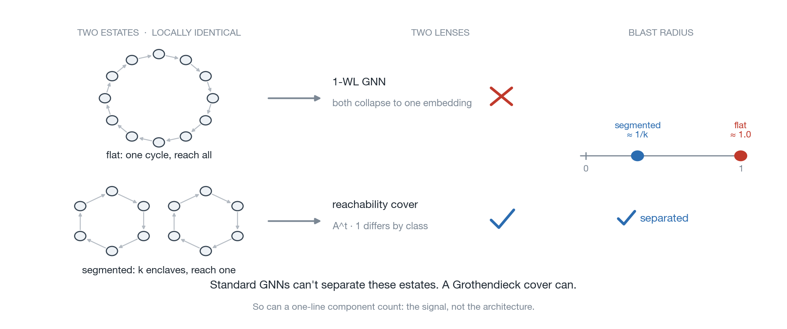

# Grothendieck GNNs for Lateral-Movement Detection



A proof of concept exploring Grothendieck Graph Neural Networks (GGNNs) on a security
task. Synthetic data, not a deployable detector.

Standard GNNs cannot recover the blast-radius signal a lateral-movement attacker
exploits. Grothendieck-style covers can. So can much simpler tools, but then I wouldn't have an excuse to make this repo. 

| model | PR-AUC | recall @ 1% FPR |
|---|---|---|
| GCN, GIN (1-WL) | ~0.03 (= base rate) | 0 |
| LogReg on # components | 1.0 | 1.0 |
| GCN + reachability feature | 1.0 | 1.0 |
| CoverNet (cover features) | 1.0 | 1.0 |

~3% positives, tested on a graph size never seen in training. The signal, not the
architecture, is what matters: once reachability is exposed, logistic regression on one
scalar solves it.

## What is this?

A clean demonstration of a known expressivity gap: 1-WL GNNs cannot see global
reachability or tell cospectral graphs apart. It is read through a lateral-movement
lens, with runnable code, rendered notebooks, and a pre-registered real-data probe. Related research is here (see
[docs/related-work.md](docs/related-work.md)).

It is not evidence that cover-based GNNs beat existing tools. Every task here is also
solved by something simpler: component counts, substructure counts, or edge novelty.
The framework's real bet is learning which structure matters instead of hand-coding it
([docs/expressivity-and-covers.md](docs/expressivity-and-covers.md#what-this-genuinely-adds)),
and the one time it was tested on real data where the signal was not built in, it lost
to a no-GNN novelty baseline (the [LANL probe](docs/lanl-probe.md) returned the
pre-registered null).

The framework comes from an ICLR 2026 submission that was withdrawn, and whose
strongest claim a reviewer disputed. The sieve demo separates Rook vs Shrikhande, a
3-WL-indistinguishable pair, so it does clear the beyond-3-WL bar, but only by
hand-injecting the discriminating substructure (the GSN mechanism). The framework's
generic covers stay 2-FWL-bounded, which is the reviewer's actual point. The WL levels
here are certified, not asserted (see `run_wl.py`). See
[References](docs/related-work.md#references).

## The task

Access graphs represent a network: nodes are hosts or accounts, and a directed edge
`u -> v` means an identity on `u` can authenticate to `v`. We classify two estates that
look identical locally but differ in blast radius.

| class | structure | training | meaning |
|------|-----------|----------|---------|
| `flat` | one directed n-cycle (e.g. a 12-cycle) | sizes vary; tested on an unseen size | every host reaches every other; compromise one, reach all |
| `segmented` | k disjoint directed cycles (e.g. two 6-cycles) | sizes and segment count vary; tested on an unseen size | isolated enclaves; compromise one, reach only its enclave |

A flat estate endangers the whole network if compromised, a segmented one only its
enclave. The two are 1-WL-equivalent by construction, which is why a standard GNN
cannot separate them. See [docs/expressivity-and-covers.md](docs/expressivity-and-covers.md).

## Quickstart

```bash
pip install -r requirements.txt
python run_experiment.py     # static: 1-WL GNNs vs the reachability cover (~1 min, CPU)
python run_sieve.py          # sieve cover separates a cospectral SRG pair
python run_temporal.py       # temporal cover: when event ordering is the signal
python run_lanl.py --smoke   # real-data probe harness, on a synthetic slice
python run_wl.py             # certify the Rook/Shrikhande WL level + cover table
```

The demos write figures to `results/`, committed so they render here without running;
`run_wl.py` prints tables instead.

## Demos

| demo | what it shows | deep dive |
|---|---|---|
| static | 1-WL GNNs sit at the base rate; the reachability cover (or a one-line component count) solves it | [expressivity-and-covers](docs/expressivity-and-covers.md) |
| sieve | swapping in the sieve cover separates Rook vs Shrikhande, a cospectral WL-indistinguishable pair | [expressivity-and-covers](docs/expressivity-and-covers.md#the-sieve-cover) |
| temporal | identical static graphs, only event ordering differs; a temporal cover recovers it (PR-AUC ~0.83) | [temporal](docs/temporal.md) |
| LANL probe | the honest test on real data: across two red-team windows the cover does not beat a no-GNN novelty baseline (the pre-registered null) | [lanl-probe](docs/lanl-probe.md) |
| WL certification | certifies the Rook/Shrikhande and CFI pairs are 3-WL-indistinguishable, and shows where the sieve cover breaks | [expressivity-and-covers](docs/expressivity-and-covers.md#where-the-sieve-breaks) |

## Repository map

| directory | purpose |
|---|---|
| `src/` | the library: data generators, graph operators, cover algebra, and models. Everything the demos and notebooks import. |
| `docs/` | written deep dives behind each demo. Read these for the why; the README is the map. |
| `notebooks/` | a four-part guided tour (covers, static, sieve, temporal) plus a WL/CFI appendix, with rendered outputs, so they read without running. |
| `results/` | committed figures the demos write, embedded in the README and docs. |
| `tests/` | smoke tests asserting the structural invariants the demos depend on. |
| `.github/` | CI: runs the tests and smoke-runs two demos on every push. |

Run scripts live at the root: `run_experiment.py`, `run_sieve.py`, `run_temporal.py`,
`run_lanl.py`, `run_wl.py`. See [docs/repo-structure.md](docs/repo-structure.md) for a
file-level map.

## Notebooks

[`notebooks/`](notebooks/) builds each idea from scratch with inline math and plots.
Start with [01_covers](notebooks/01_covers.ipynb). Kernel setup is in
[notebooks/README.md](notebooks/README.md).

## Limitations

A minimal demonstration of one mechanism, not a deployable detector.

- Structure must be the signal. The task is 1-WL-equivalent by construction. When
  node or edge features already carry the signal, a plain GCN matches this and the
  advantage disappears.
- Simpler tools tie it. On every task a classical method matches the cover. The unique
  value would be learning which cover matters, which these pre-rigged tasks cannot show.
- Bounded for tractability. Reachability operators trend toward dense, ~O(n^3)
  computation. Real estates would need sparse, ego-net-restricted covers.
- Static and synthetic for the core demos. The [LANL probe](docs/lanl-probe.md) is the
  one real-data test, and it returned the pre-registered null: the cover does not beat a
  novelty baseline once the signal isn't built in.
- Built on a withdrawn, disputed source. See [References](docs/related-work.md#references).

## More

- [Expressivity and covers](docs/expressivity-and-covers.md)
- [When time is the signal](docs/temporal.md)
- [Real-data probe (LANL)](docs/lanl-probe.md)
- [Related work and references](docs/related-work.md)
- [Repository structure](docs/repo-structure.md)

Built as a portfolio proof of concept. Synthetic data only.
