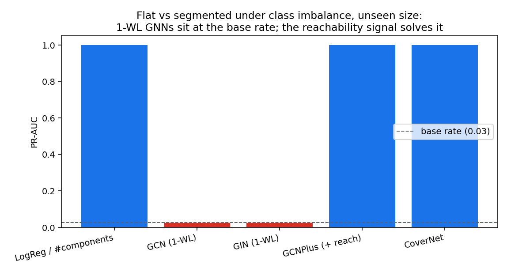
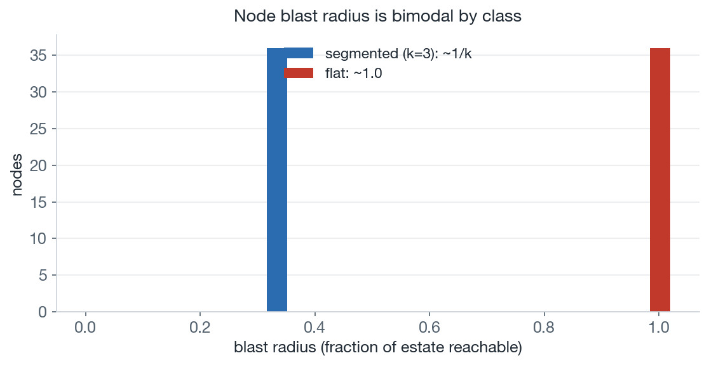
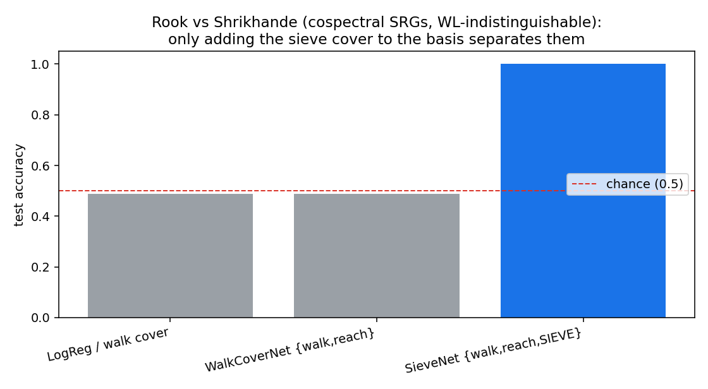
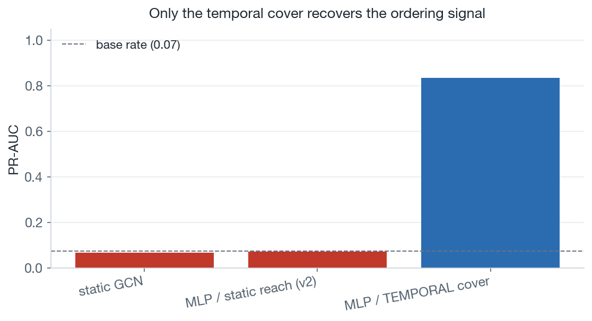
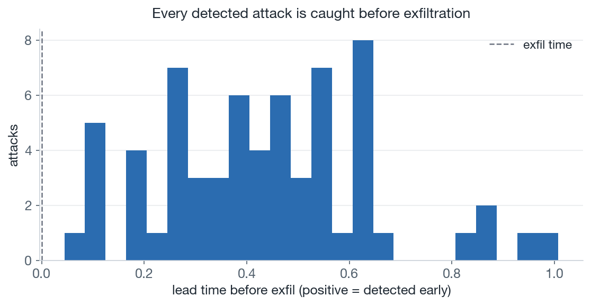

# Cover-Based GNNs for Lateral-Movement Detection — a proof of concept

This repo is my attempt to understand Grothendieck Graph Neural Networks (GGNNs)
and apply them to a security use case. It is a small proof of concept on synthetic
data, not a deployable detector.

Out-of-the-box GNNs can depict networks, but cannot recover the signal of a "blast radius" that a laterally moving attack might target. Adding Grothendieck-derived 'covers' can recover this signal. 



| model | PR-AUC | recall @ 1% FPR |
|---|---|---|
| GCN, GIN (1-WL) | ~0.03 (= base rate) | 0 |
| LogReg on # components | 1.0 | 1.0 |
| GCN + reachability feature | 1.0 | 1.0 |
| CoverNet (cover features) | 1.0 | 1.0 |

*~3% positives, tested on an unseen graph size. The **signal**, not the
architecture, is what matters: once reachability is exposed, even logistic
regression on a single scalar nails it.*

## Use case

Networks can be represented by graphs, called access graphs. Nodes/vertices are hosts, end devices, or user accounts, and a directed edge `u → v` represents that an identity on `u` can authenticate to `v`. 
We classify two
estates that look identical *locally* but differ in **blast radius**:

| class | structure | meaning |
|------|-----------|---------|
| `flat` | one directed 12-cycle | every host reaches every other — compromise one, reach all |
| `segmented` | k disjoint directed cycles | isolated enclaves — compromise one, reach only its enclave |

The example uses one 12-cycle vs two 6-cycles; the dataset varies size and segment
count, and tests on a size never seen in training. Telling these apart is the core
of lateral-movement risk — and a standard GNN can't do it.

## The 1-Weisfeiler-Leman Test

Message-passing GNNs are bounded by the **1-Weisfeiler-Leman (1-WL)** test. In both
classes every node has in-degree 1, out-degree 1, and the same feature, so 1-WL
gives every node the same colour forever — and a flat estate and a segmented one
end up with the **same** embedding. That's why GCN and GIN score at the base rate.

The missing signal is **global reachability**: the fraction of the estate each node
can reach (~1.0 when flat, ~1/k when split into k enclaves), or equivalently the
number of connected components (1 vs k). It's a property of the whole graph, not of
any neighbourhood — so a 1-WL model can't recover it.



## So why Grothendieck?

GGNNs generalise a node's *neighbourhood* to a **cover**: a family of directed paths
written as matrices, where matrix multiplication is path concatenation. `CoverNet`
uses one small instance — the reachability cover up to `K` hops — exposing, per node:

* arriving walks of length `t` (`Aᵗ · 1`),
* closed walks of length `t` (`diag(Aᵗ)`) — the cycle signal 1-WL misses,
* the size of its reachable set within `K` hops — the **blast radius**.

An MLP over these solves the task exactly. Same idea at larger scale: the paper
shows cover/sieve operators separate graphs that defeat even 3-WL.

## Run it

```bash
pip install -r requirements.txt
python run_experiment.py
```

Runs in under a minute on CPU. Prints a results table and writes
`results/pr_auc.png` and `results/separation.png`.

## Guided notebooks

If you'd rather read than run, [`notebooks/`](notebooks/) is a four-part tour —
covers → static → sieve → temporal — building each idea from scratch with inline
math and plots. Start with [01_covers](notebooks/01_covers.ipynb); they're committed
with outputs rendered, so they read without running anything. Kernel setup is in
[notebooks/README.md](notebooks/README.md).

## The sieve cover

```bash
python run_sieve.py
```

The reachability cover is real GGNN machinery, but it does no *unique* work above —
a plain component count ties it. So this demo picks a task where ordinary covers
**provably** fail.

Distinguish the 4×4 **Rook's graph** from the **Shrikhande graph**: both are
SRG(16,6,2,2), non-isomorphic, WL-indistinguishable, and **cospectral**. Cospectral
means their walk and closed-walk counts match at every length — the script prints
`Tr(Aᵗ) = 0, 96, 192, 1536, 7680` for both — so any walk- or reachability-based
model is at chance.

The **sieve cover** looks instead at the structure *among* a node's neighbours: the
subgraph they induce. That's two triangles in Rook and a single 6-cycle in
Shrikhande — the same C₆-vs-2·C₃ motif as before, now a *local* invariant.



`WalkCoverNet` and the trivial baseline sit at chance; `SieveNet` — the same
architecture with the sieve cover added — reaches 100%. The whole gap comes from one
cover choice: the GGNN thesis ("design message passing by choosing covers"), made
load-bearing on a pair that defeats WL.

*(The sieve cover here is one principled instantiation of a precomposition-refined
cover, not a verbatim copy of the paper's construction, which public sources
under-specify.)*

## When time is the signal

```bash
python run_temporal.py
```

The static demos show a *model* limit. This one shows a *representation* limit:
collapse a stream of timestamped events into a static graph and you throw away the
ordering — and ordering is the signal.

Both classes share an **identical static graph**. Every stream has the same chain
`f → … → g`, the same background traffic, and an exfiltration event. Only the chain's
*timestamps* differ:

* **attack** — chain edges fire in increasing order, so a time-respecting path
  `f → g` exists, and exfil follows.
* **benign** — the same edges fire scrambled, so no time-respecting path exists.

Since the static graph is identical, any static model is stuck at the base rate. The
fix is a **temporal cover**: time-respecting reachability from a single time-ordered
sweep (the temporal analogue of summing powers of `A`). Categorically, that sweep is
the **causal past** of an event.



A static GCN and an MLP on static-reachability features both sit at the ~7% base
rate; the same MLP on **temporal** cover features reaches PR-AUC ~0.83. Not perfect,
and that's honest: the leftover false positives are benign streams whose scrambled
chain happens to land in order (~1/5! of the time) — something only event
correlation could clean up.



Time also gives a metric a static model can't even define: how long before exfil the
path completes. Every detected attack gets positive lead time — caught before the
data leaves.

## Repository layout

```
src/data.py        access-graph generator: imbalanced, variable size,
                   train/test split with an unseen size (generalization probe)
src/operators.py   1-hop propagators, reachability-cover features, components count
src/models.py      GCN, GIN (1-WL); GCNPlus (GCN + cover feats); CoverNet
run_experiment.py  static demo: + trivial LogReg-on-#components baseline; PR-AUC
                   and recall@1%FPR over 3 seeds; renders both figures
src/covers.py      explicit cover algebra: Tr homomorphism, walk / reachability
                   / sieve covers
src/srg_data.py    Rook's vs Shrikhande SRG pair (WL-indistinguishable, cospectral)
src/sieve_models.py  cover-combining models with learnable per-cover gates
run_sieve.py       sieve demo: only adding the sieve cover separates the SRG pair
src/temporal_*.py  temporal demo: event-stream generator, time-respecting
                   reachability operator, and models
run_temporal.py    temporal demo runner (static models vs temporal cover) +
                   an early-detection (lead-time) metric
notebooks/         four-part guided tour (covers -> static -> sieve -> temporal),
                   each importing from src/ with rendered outputs
```

## Limitations and honest scope

A minimal demonstration of one mechanism, **not** a deployable detector:

* **Structure must be the signal.** The edge exists precisely because the classes
  are 1-WL-equivalent. When node/edge features already carry the signal (ports,
  byte counts, timing), a plain GCN can match this and the advantage disappears.
* **Bounded for tractability.** Reachability operators trend toward dense, ~O(n³)
  computation. Here `K` is small and graphs are tiny; real estates would need
  sparse / ego-net-restricted covers — exactly where the gain could erode.
* **Static and synthetic.** Real telemetry is streaming, time-ordered, typed, and
  heavily imbalanced. None of that is modelled here.
* **Robustness untested.** An attacker can pad benign-looking hops; a more
  expressive operator isn't automatically a more robust one.

## Possible extensions

* Time-ordered covers for provenance-graph APT detection — the natural next domain.
* A real-data sanity check on a small slice of the LANL authentication dataset
  around labelled red-team events.
* Typed/heterogeneous covers per edge type; sparse operators for scale.

## Related work — where this sits

This PoC sits at the intersection of three literatures that rarely cite each other.
It isn't a new state of the art — it's a bridge between them.

**Expressivity beyond 1-WL.** Standard MPNNs are bounded by the 1-WL test (Xu et al.,
*GIN*, 2019; Morris et al., *k-GNNs*, arXiv:1810.02244), and the logic/WL
correspondence is now well understood (Grohe, *The Logic of GNNs*, arXiv:2104.14624).
The families that break the ceiling — higher-order k-WL networks, subgraph GNNs
(Bouritsas et al., *GSN*, arXiv:2006.09252; Bevilacqua et al., *ESAN*, 2022), and
substructure/positional encodings — all share the tension this repo faces too:
**expressivity trades off against scalability**. Recent work chases cheap expressivity
(e.g. invariant-stratified propagation, Hevapathige et al., arXiv:2603.01388, KDD
2026). The SRG/CSL/BREC isomorphism benchmarks are the standard yardsticks, and GSN
already reported strong SRG results given domain-chosen substructures.

**Topological & categorical deep learning** is where the *cover* idea belongs: sheaf
neural networks (Hansen–Ghrist; Bodnar et al., *Neural Sheaf Diffusion*, 2022),
simplicial/cellular networks, and topological deep learning over combinatorial
complexes (Hajij et al., 2023). The live trend is unification — *Copresheaf
Topological Neural Networks* (arXiv:2505.21251) subsumes GNNs, attention, sheaf nets,
and TNNs under one formalism, the broader current the Grothendieck framework swims in.

**GNN-based intrusion / APT detection** is active but driven by different concerns —
temporal modelling, false-positive rates, reproducibility. Representative systems:
MAGIC (USENIX Security 2024), Kairos (arXiv:2308.05034, temporal GNN over
provenance), Slot (CCS 2025, graph RL), CONTINUUM (arXiv:2501.02981, spatio-temporal),
and JBEIL, which targets **lateral movement** specifically. A 2025 reproducibility
study (ACM REP '25) documents how brittle several of these pipelines are. Notably,
none frames detection as a 1-WL-expressivity problem — the gap this PoC points at.

**Positioning.** The detection community thinks temporally but not in
cover/expressivity terms; the expressivity community rarely touches authentication or
provenance graphs. This repo makes the bridge explicit on a minimal example: a task
1-WL provably can't solve, that a reachability cover resolves by construction. The
natural next step — a *time-ordered* cover aligned with the TGN-style systems above —
is where the genuine whitespace lies.

## References

* Paper: *Grothendieck Graph Neural Networks Framework: An Algebraic Platform for
  Crafting Topology-Aware GNNs* — arXiv:2412.08835. An ICLR 2026 submission of this
  work was later withdrawn, so treat its claims as an unrefereed preprint.
* The `flat` vs `segmented` construction is the security reading of the classic
  C₆ vs 2·C₃ counterexample to 1-WL.

*Built as a portfolio proof of concept. Synthetic data only; no real network
telemetry is used.*
